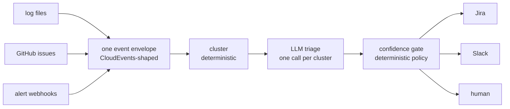

# AIOpsAnalyst

One triage pipeline for every event stream. Server logs, GitHub issues and
alerts go in; deduplicated clusters with a category, a severity, a confidence
and an evidence trail come out, and a policy table decides what happens to each
one - a Jira ticket, a Slack message, or a human.

The open-source tools in this space each own one silo: alert managers cluster
alerts, issue bots label issues, log tools parse logs. The workflow underneath
is the same three steps in all of them, so this builds the workflow once and
makes the sources adapters.

## The part most of these projects skip: a measured number

Triage quality is a claim. Here is the measurement, the ground truth it used,
and the procedure that produced it.

**Against labels applied by the maintainers of the repositories themselves**
(`bug`, `kind/feature`, and similar, on issues from transformers, next.js,
pytorch, langchain, vscode and kubernetes), as of 2026-09-11:

| | |
|---|---|
| clusters compared | 34 |
| raw agreement | 0.882 |
| Cohen's kappa | **0.749** (95% CI 0.506 - 0.939, bootstrap, seeded) |
| defect | precision 0.91, recall 0.95 (n=22) |
| feature_request | precision 1.00, recall 0.75 (n=12) |
| prompt version | 1.1 |
| models that answered | gpt-oss-120b (9), qwen3.8-27b (25) |

Full scorecard: [`eval/scorecard-external.json`](eval/scorecard-external.json).

Why this ground truth rather than self-made labels: nobody on this project chose
those labels, and anyone can open the issue and check. Maintainer vocabularies
do not distinguish "the process died" from "an operation failed", so the
comparison runs on a collapsed taxonomy (`defect` covers crash and error) - that
limitation, the mapping table, the six-class taxonomy used internally, the
annotation procedure and the known biases are written down in
[`eval/CODEBOOK.md`](eval/CODEBOOK.md).

The interval is wide because 34 pairs is a small sample. That is what the
interval is for, and the set grows by harvesting more labelled issues rather
than by labelling more myself.

Rules the numbers follow: labels are made blind to the model's verdicts;
agreement is computed before any prompt change; every verdict stores the prompt
version and the model that answered, and a mixed-version comparison is discarded
rather than averaged.

## Deterministic work first, LLM last



Clustering runs before any model sees anything, and the model classifies
clusters, never events. On the OpenSSH dataset from Loghub-2.0 that is 638,947
lines to 39 templates: the model reads 39 things instead of 638,947, which is
both the cost argument and the reliability argument.

Measured on that dataset: compression 16,383x, grouping accuracy 0.7067 against
the published ground-truth templates (in line with Drain's published results),
identical output across two runs, 79k lines/second. Reproduce by fetching
the dataset as described in `corpus/README.md`, then
`python eval/bench_loghub.py corpus/data/OpenSSH/OpenSSH_full.log_structured.csv`.

Three clustering tiers, chosen per payload rather than one algorithm everywhere:
a deterministic fingerprint over configured key fields for structured alerts,
Drain3 template mining for log lines, and MinHash LSH followed by MiniLM
embeddings for prose. No UMAP or HDBSCAN: they cluster prose better and they do
not reproduce run to run, and a number that cannot be reproduced is not worth
having.

## The model labels, the rules act

Every verdict carries a confidence, and a deterministic table - not the model -
decides the consequence:

| tier | when | what happens |
|---|---|---|
| auto | confidence >= 0.9 | routed to its sink without asking |
| suggest | confidence >= 0.7 | drafted, waits for a person |
| escalate | low confidence, or any critical severity | a human is told |
| abstain | neither | recorded, nothing sent |

Critical severity escalates regardless of confidence: paging someone is cheap,
a wrong automatic action during an outage is not. Thresholds live in config, and
the routing table is YAML (see [`pipeline.example.yaml`](pipeline.example.yaml)).

Side effects are idempotent. A `(cluster, sink)` pair is recorded only after the
sink reports success, so a sink that is down costs a retry, never a duplicate
ticket.

## Adding a source or a sink

Two methods and a decorator; the core imports no adapter:

```python
@register("github_issues")
class GitHubIssuesSource(Source):
    def fetch(self, cursor: str | None = None) -> Iterator[Event]: ...

@register("jira")
class JiraSink(Sink):
    def emit(self, decision: Decision) -> str | None: ...
```

Adapters own parsing and nothing else. Each source keeps its own cursor, event
ids are deterministic, and inserts are `INSERT OR IGNORE`, so a stateless cron
run behaves like a continuous pipeline: re-reading a file or re-polling an API
inserts nothing twice.

## Running it

```bash
conda create -n aiopsanalyst python=3.12 -y
conda activate aiopsanalyst
pip install -e ".[dev,cluster,embeddings,server]"
cp .env.example .env          # GROQ_API_KEY and GITHUB_TOKEN are enough to start
cp pipeline.example.yaml pipeline.yaml
pytest                        # 133 tests
uvicorn server.app:app        # /api/stats, /api/clusters, /api/triage
```

`AIOPS_DB` points the API at a store. LLM providers are tried in order and any
subset works; with no key at all the deterministic half of the pipeline still
runs and clusters are left untriaged rather than guessed at.

## What this is not

It does not take remediation actions on infrastructure, does not ship its own
monitoring, and has no agent loop. Those are deliberate omissions, not a roadmap
slipping: every one of them needs a trust story this project has not earned yet,
and the measured part is the point.

Corpus: two log sources and six repositories. Nothing here is a claim about
production systems in general.
