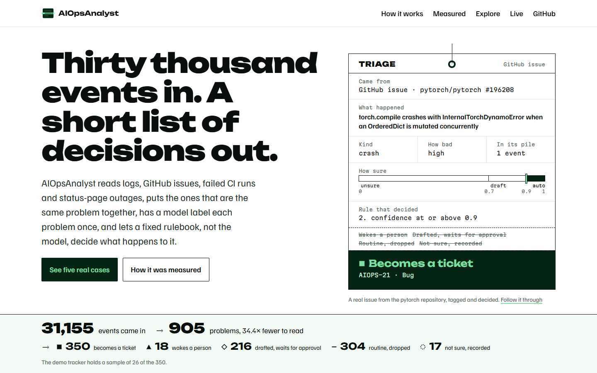
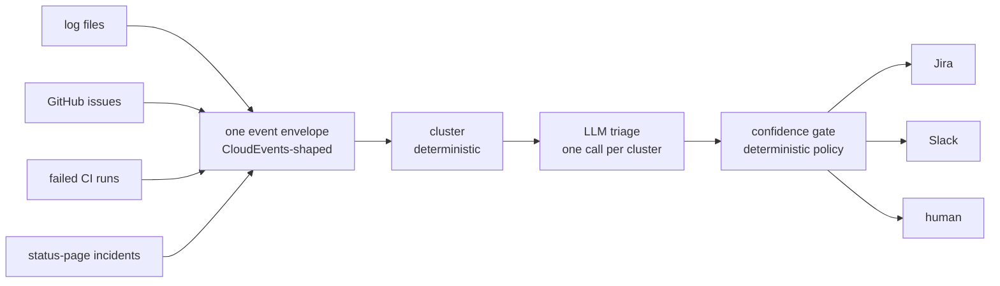
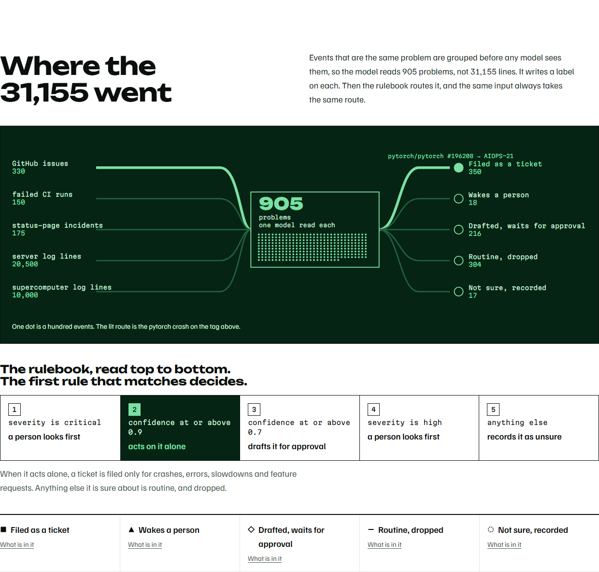

# AIOpsAnalyst

**[ai-ops-analyst.vercel.app](https://ai-ops-analyst.vercel.app/)** &mdash; the five
outcomes, real cases followed from event to decision, how it was measured, every
pile it sorted into, and the live feed.

[](https://ai-ops-analyst.vercel.app/)

One triage pipeline for every event stream. Server logs, GitHub issues, failed
CI runs and status-page incidents go in; deduplicated clusters with a category, a severity, a confidence
and an evidence trail come out, and a policy table decides what happens to each
one - a Jira ticket, a Slack message, or a human.

The open-source tools in this space each own one silo: alert managers cluster
alerts, issue bots label issues, log tools parse logs. The workflow underneath
is the same three steps in all of them, so this builds the workflow once and
makes the sources adapters.

## The part most of these projects skip: a measured number

Triage quality is a claim. Here is the measurement, the ground truth it used,
and the procedure that produced it.

**Against labels applied by the maintainers of the repositories themselves**
(`bug`, `kind/feature` and similar, on issues from transformers, next.js,
pytorch, langchain, vscode and kubernetes):

| | |
|---|---|
| Cohen's kappa | **0.631** (95% CI 0.493 - 0.763, bootstrap, seeded) |
| raw agreement | 0.820 |
| defect | precision 0.94, recall 0.82 (n=78) |
| feature_request | precision 0.84, recall 0.81 (n=32) |
| clusters compared | 111 |
| prompt version | 1.1 |

Full scorecard: [`eval/scorecard-external.json`](eval/scorecard-external.json).

Nobody on this project chose those labels, and anyone can open the issue and
check. Maintainer vocabularies do not distinguish "the process died" from "an
operation failed", so the comparison runs on a collapsed taxonomy (`defect`
covers crash and error); the mapping, the six-class taxonomy used internally,
the annotation procedure and the known biases are in
[`eval/CODEBOOK.md`](eval/CODEBOOK.md).

An earlier run of this measurement scored 0.749 on 34 clusters. Tripling the
sample moved it to 0.610, inside the earlier run's published interval, which is
what an interval is for; re-triaging the corpus later put it at the 0.631 above.
None of those are corrections of each other - they are the same measurement
drawing a different sample of model behaviour, which the run table below sizes.

### The rubric revision that was measured and rejected

The figure sits near the bottom of the band usually called substantial, so the
prompt was revised. Properly: the labelled set was cut in half with a seed, the
disagreements in the dev half were read, three boundary rules were written
against them, and the held-out half decided
([`eval/split.py`](eval/split.py), [`eval/prompt_experiment.py`](eval/prompt_experiment.py)).

It won its half, repeatedly:

| prompt | kappa on the held-out 56, one entry per run | spread |
|---|---|---|
| 1.1 | 0.565, 0.584 | 0.019 |
| 1.2 | 0.604, 0.649, 0.764 | 0.160 |

And it was still rejected, because the rules were written against GitHub issues
and the pipeline is not only issues:

| | 1.1 | 1.2 |
|---|---|---|
| alert recall on the supercomputer log (80,000 lines then) | 1.00, 3 of 3 incident types | 0.998, 2 of 3 |
| questions reaching the right cluster | hit@1 0.90 | hit@1 0.80 |
| clusters escalated to a human | 5, three of them critical | 0 |
| verdicts using the critical severity | 3 | **0** |

The last row decided it. Adding category rules made the model stop using
`critical` at all, which silences the one gate rule that ignores confidence
entirely - the rule that exists so an outage is never actioned automatically on
a 0.95. A prompt that improves the metric it was tuned against while quietly
removing a safety branch is not an improvement.

1.2 stays in the code (`SYSTEMS["1.2"]`) so both sides of this can be rerun,
and the run-by-run figures are in
[`eval/scorecard-runs.json`](eval/scorecard-runs.json). The spread there is
worth its own note: three runs of the same prompt over the same 56 clusters
ranged from 0.604 to 0.764, because the free tiers meter per model per minute
and each run lands on a different mix. Any single kappa published anywhere
carries about that much slack.

**Against the alert labels that Lawrence Livermore's operations staff applied to
their own supercomputer logs** (the BGL dataset, published with Oliner and
Stearley, DSN 2007), 10,000 lines - every eighth line of the first 80,000:

| | |
|---|---|
| clusters a responder reads | **14** of 40, down from 10,000 lines |
| incident types preserved | **2 of 2** clusters carrying operator alerts are surfaced |
| alert recall | **1.00** &mdash; all 66 operator-flagged lines surfaced |
| line-level precision | 0.07 |
| line-level noise suppression | 91% in this run; 9% to 93% across earlier runs |

Full scorecard: [`eval/scorecard-bgl.json`](eval/scorecard-bgl.json).

The sample is taken by position and never by label. Keeping every flagged line
would have preserved a third incident type - `KERNMC`, a single line in the
80,000 - and made the evaluation measure a corpus filtered on its own answer
key, so the type was lost instead and is reported lost.

The cluster numbers are the ones that hold. The line numbers move enormously
between runs, and the reason is a single cluster: `generating <*>` is 8,186 of
the 10,000 lines, and the lines read `RAS KERNEL INFO generating core.304`. That
is a core dump. As text it is a crash; to the people who ran a machine where
jobs die constantly it is background, and they labelled every one of those lines
routine. The model has landed on both sides across runs, and because the
cluster is 82% of the corpus, noise suppression follows it
([`eval/scorecard-runs.json`](eval/scorecard-runs.json)).

That is worth more than a tidier number would be. A line-level metric on log
data is hostage to whichever cluster happens to be biggest, which is exactly why
the cluster view is reported first: 14 things to read instead of 10,000, with
every incident type the operators flagged still among them.

The label never reaches the model: the parser keeps it in the event's attributes
and the prompt is built from the title and body, which a test asserts.

Rules the numbers follow: labels are made blind to the model's verdicts;
agreement is computed before any prompt change; every verdict stores the prompt
version and the model that answered, and a mixed-version comparison is discarded
rather than averaged.

## Deterministic work first, LLM last



Clustering runs before any model sees anything, and the model classifies
clusters, never events. On the OpenSSH dataset from Loghub-2.0 that is 638,947
lines to 39 templates: the model reads 39 things instead of 638,947, which is
both the cost argument and the reliability argument.

Measured on that dataset: compression 16,383x, grouping accuracy 0.7067 against
the published ground-truth templates (in line with Drain's published results),
identical output across two runs, 79k lines/second. Reproduce by fetching
the dataset as described in `corpus/README.md`, then
`python eval/bench_loghub.py corpus/data/OpenSSH/OpenSSH_full.log_structured.csv`.

Three clustering tiers, chosen per payload rather than one algorithm everywhere:
a deterministic fingerprint over configured key fields for structured alerts,
Drain3 template mining for log lines, and MinHash LSH followed by MiniLM
embeddings for prose. No UMAP or HDBSCAN: they cluster prose better and they do
not reproduce run to run, and a number that cannot be reproduced is not worth
having.



The API runs locally against a store with `uvicorn server.app:app`. The public site
(Astro, in `web/`) is static and reads the exported corpus. To work on it:
`cd web && npm install && npm run dev`.

## Asking the corpus

Three kinds of question arrive at a triage system and only one of them wants
prose. "When did the data TLB errors begin" wants a timestamp, "how many missing
file errors" wants a count, and SQL knows both exactly while a model would
approximate them from whatever text it was shown. So retrieval finds the
clusters, SQL answers the question, and every answer names the clusters and
sample events behind it. `/api/ask` calls no model: triage already classified
these clusters, and asking one to re-read its own output only adds a way to be
wrong.

Measured on 20 questions written against the corpus before the retriever was
ever run, and not edited afterwards ([`eval/questions.yaml`](eval/questions.yaml),
[`eval/scorecard-ask.json`](eval/scorecard-ask.json)):

| | |
|---|---|
| hit@1 | **0.80** |
| hit@3 | 0.90 |
| routing accuracy | 1.00 |

The misses are the same failure: the question uses words the corpus never
does. "What happened with the Tomcat connector" is asking about templates that
say `mod_jk`, and the embedding model does not know `mod_jk` is Tomcat's
connector. "What is failing on the web server" was a hit until the corpus grew:
an OpenStack cluster about a VM terminating `httpd` now outranks the Apache
`File does not exist` cluster, which drops to third. That is the cost of a
larger corpus, not a regression in the retriever, and it is published as
measured. A semantic pass over MiniLM embeddings was added for vocabulary gaps
and did not move the number; widening its reserved slots would have, which is
how a knob gets tuned against the test it is measured by, so it was left alone.

## The model labels, the rules act

Every verdict carries a confidence, and a deterministic table - not the model -
decides the consequence:

| first rule that matches | tier | what happens |
|---|---|---|
| severity is critical | escalate | a human is told |
| confidence >= 0.9 | auto | routed to its sink without asking |
| confidence >= 0.7 | suggest | drafted, waits for a person |
| severity is high | escalate | a human is told |
| anything else | abstain | recorded, nothing sent |

Critical severity escalates regardless of confidence: paging someone is cheap,
a wrong automatic action during an outage is not. The rules are an ordered table
in [`aiops/triage/gate.py`](aiops/triage/gate.py), exported verbatim for the site,
and the routing table is YAML (see [`pipeline.example.yaml`](pipeline.example.yaml)).

Side effects are idempotent. A `(cluster, sink)` pair is recorded only after the
sink reports success, so a sink that is down costs a retry, never a duplicate
ticket.

## Adding a source or a sink

Two methods and a decorator; the core imports no adapter:

```python
@register("github_issues")
class GitHubIssuesSource(Source):
    def fetch(self, cursor: str | None = None) -> Iterator[Event]: ...

@register("jira")
class JiraSink(Sink):
    def emit(self, decision: Decision) -> str | None: ...
```

Adapters own parsing and nothing else. Each source keeps its own cursor, event
ids are deterministic, and inserts are `INSERT OR IGNORE`, so a stateless cron
run behaves like a continuous pipeline: re-reading a file or re-polling an API
inserts nothing twice.

## Running it

```bash
conda create -n aiopsanalyst python=3.12 -y
conda activate aiopsanalyst
pip install -e ".[dev,cluster,embeddings,server]"
cp .env.example .env          # GROQ_API_KEY and GITHUB_TOKEN are enough to start
cp pipeline.example.yaml pipeline.yaml
pytest                        # 224 tests
uvicorn server.app:app        # API on http://127.0.0.1:8000
```

`AIOPS_DB` points the API at a store. LLM providers are tried in order and any
subset works; with no key at all the deterministic half of the pipeline still
runs and clusters are left untriaged rather than guessed at.

## What this is not

It does not take remediation actions on infrastructure, does not ship its own
monitoring, and has no agent loop. Those are deliberate omissions, not a roadmap
slipping: every one of them needs a trust story this project has not earned yet,
and the measured part is the point.

Corpus: six Loghub log datasets (OpenSSH, Apache, OpenStack, ZooKeeper, Linux,
Blue Gene/L), issues from six repositories, failed CI runs from three, and
incidents from four public status pages - 31,155 events in 905 clusters.
Nothing here is a claim about production systems in general.
